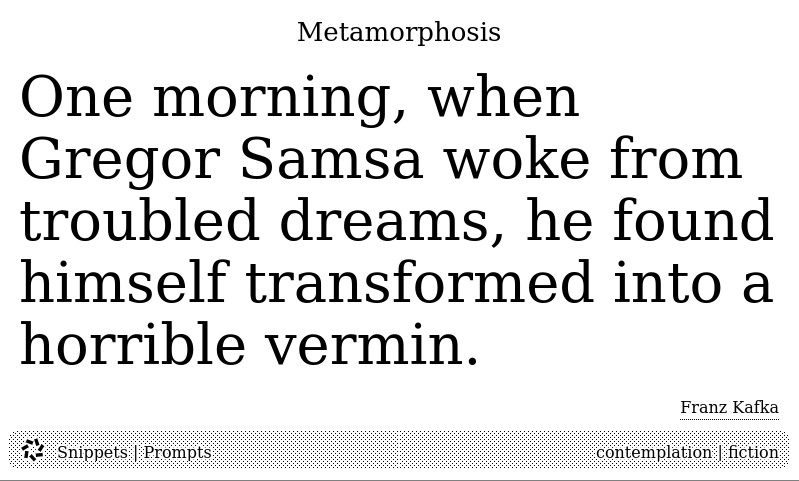
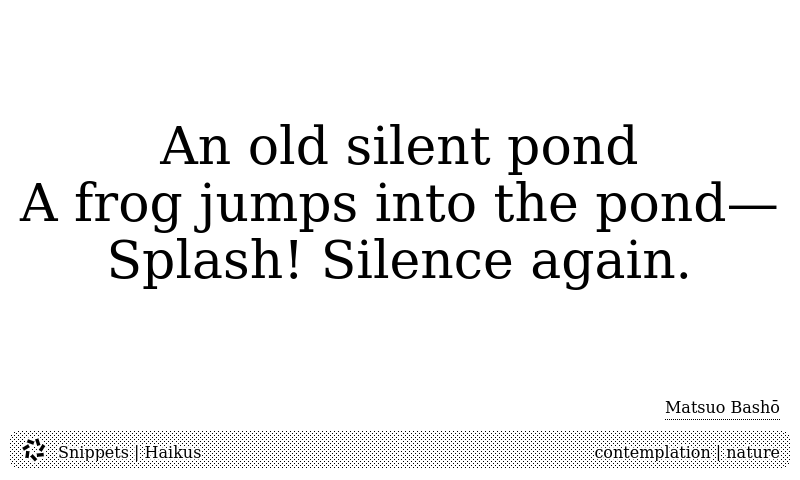

## Summary

* goal: generate simple text screens for trmnl
* read input text file, pick a paragraph, render it
* generating HTML and using trmnl screenshot plugin to display it

Given an input file like this:

    # Haikus

    An old silent pond
    A frog jumps into the pond—
    Splash! Silence again.
    -Matsuo Bashō
    % style: centered
    % theme: contemplation nature

    # Prompts

    # Metamorphosis
    One morning, when Gregor Samsa woke from troubled dreams, he found himself transformed into a horrible vermin.
    -Franz Kafka
    % theme: contemplation fiction

You can generate HTML pages like this:

Or this:

Just run `render.py`, host the resulting HTML somewhere and point TRMNL's
screenshot plugin at it.

## Notes

Basing HTML off of this starter: https://docs.usetrmnl.com/go/private-plugins/templates

Variations I want:

* left justified so the right hand side of poems look jagged
* no/smaller title
* title and label at top and bottom of page to give content more space
* preserve leading whitespace for weird poem formatting?

Markdown metadata formats: https://stackoverflow.com/questions/44215896/markdown-metadata-format
I'm thinking yaml front matter for top level styles (eg everything under an
H1) and % for per para directives, if needed.
